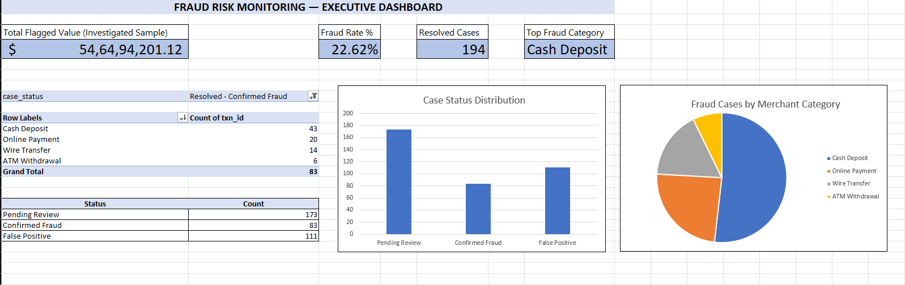

# Financial Transaction Monitoring & Fraud Risk Analytics System

A rule-based AML (Anti-Money Laundering) and financial-crime triage pipeline built in SQL Server and Excel - designed to mirror how an operational risk/fraud team actually investigates flagged transactions, rather than a generic machine-learning fraud classifier.

## Overview

This project is a working fraud/AML investigation system, not just a detection model. SQL rules flag suspicious transactions based on real financial-crime patterns (structuring, statistical outliers, velocity, impossible travel), and an Excel workbook lets an investigator look up an account, see exactly why it was flagged, and track the case through to resolution.

The project answers three questions an operational risk team asks:
1. **Which transactions look suspicious, and why?** (SQL rule engine)
2. **How does an investigator work a flagged account?** (Excel Alert Triage sheet)
3. **How is the case backlog being managed?** (Case Tracker with resolution rates)

## Dashboard Preview



The executive dashboard summarizes flagged transaction value, fraud rate, resolved case count, and top fraud category, backed by a case-status breakdown and fraud-category distribution chart — both pivot-driven and interactive via slicers on the CaseTracker sheet.

## Dataset

**Source:** [PaySim — Synthetic Financial Datasets For Fraud Detection](https://www.kaggle.com/datasets/ealaxi/paysim1) (Kaggle), a widely-used simulation of mobile-money transaction logs.

**Why PaySim, and not the standard credit-card dataset:** the more commonly used Kaggle "creditcard.csv" is PCA-anonymized (`V1...V28`), which makes it unusable for rule-based investigation — there's no account ID, timestamp granularity, or transaction type to build real AML logic against. PaySim retains interpretable fields (`type`, `amount`, `nameOrig`, `nameDest`, balances, `isFraud`) that support genuine rule design.

**Enrichment:** PaySim has no geolocation and only hour-level timestamps, so both were added via SQL Server:
- **Regions** — a static reference table of 8 Indian cities with coordinates
- **Accounts** — each `nameOrig` deterministically mapped to a "home region" (`CHECKSUM`-based, so mappings are reproducible)
- **Merchants** — each `nameDest` mapped to a `merchant_category` derived from its dominant transaction type
- **Timestamps** — PaySim's hourly `step` expanded into full datetimes with randomized minute/second offsets
- **Injected travel anomalies** — ~3% of transactions deliberately assigned a region different from the account's home region, to give the impossible-travel rule genuine test cases

**Sample size:** 308,213 transactions (all 8,213 known fraud cases + a random sample of 300,000 legitimate transactions from PaySim's full 6.36M-row dataset).

## SQL Fraud Detection Rules

All rules are implemented in T-SQL using window functions (`LAG()`), aggregate `HAVING` clauses, and `CASE WHEN` risk scoring. Full script: [`/sql/fraud_detection_queries.sql`](./sql/fraud_detection_queries.sql).

| Rule | Logic | Result |
|---|---|---|
| **Velocity Check** | Self-join detecting >5 transactions per account within any rolling 10-minute window | 0 matches* |
| **Structuring / Smurfing** | Cash deposits between $9,500–$9,999 (just under the $10,000 reporting threshold) | **117 transactions** flagged |
| **Outlier Amounts** | Transactions >3 standard deviations above their transaction-type peer average | **4,246 transactions** flagged (concentrated in `CASH_OUT`) |
| **Impossible Travel** | `LAG()` comparing consecutive transaction regions per account within a 60-minute window | 0 matches* |

*\*See Dataset Limitations below — these two rules require repeat-account activity that PaySim's per-account structure doesn't provide.*

**Risk scoring logic:** tiers are assigned by regulatory severity, not signal overlap. Structuring is classified **High** independent of any other signal, since deliberately evading a reporting threshold is itself a compliance violation. Statistical outliers are classified **Medium**, pending investigation.

| Risk Tier | Transaction Count |
|---|---|
| High | 117 |
| Medium | 4,246 |
| Low | ~303,850 |

## Excel Investigation Workbook

File: [`/excel/FraudFCRM_Investigation.xlsx`](./excel/FraudFCRM_Investigation.xlsx)

- **AlertTriage** — an investigator enters an Account ID and `XLOOKUP` pulls the transaction's full context (type, amount, merchant category, region, risk score) along with a color-coded Priority Action flag (Immediate Review / Monitor / No Action) via conditional formatting.
- **CaseTracker** — a pivot table cross-tabbing case status (Pending Review / Resolved – Confirmed Fraud / Resolved – False Positive) against risk tier, with slicers for interactive filtering, plus calculated False Positive Rate, Confirmed Fraud Rate, and Pending Rate.
- **Dashboard** — executive KPI summary: Total Flagged Value, Fraud Rate %, Resolved Case count, Top Fraud Category, with supporting bar and pie charts.

**Note on case status:** PaySim contains no investigation-workflow data (that's inherently a human/operational process, not something a transaction log records). A representative case-tracking sample of 367 flagged transactions (117 High + a 250-row random sample of Medium) was tagged with realistic case outcomes to demonstrate the triage and reporting workflow.

## Key Findings

**Full dataset (308,213 transactions):**
- **117 transactions** flagged High risk (structuring pattern)
- **4,246 transactions** flagged Medium risk (statistical outliers)
- **$82,368,713.85** total value across all flagged (High + Medium) transactions

**Investigated case-tracking sample (n=367):**
- **False Positive Rate:** 30.25%
- **Confirmed Fraud Rate:** 22.62%
- **Pending Review:** 47.14%
- **Top Fraud Category (Confirmed Cases):** Cash Deposit (43 of 83 confirmed cases)

## Dataset Limitations

Two of the four rules — Velocity and Impossible Travel — depend on an account having multiple transactions to compare against (a rolling window, or a "previous" transaction via `LAG()`). PaySim's simulation design means the large majority of `nameOrig` values appear only once in the dataset, so these rules return no matches here — not because the SQL logic is flawed, but because the underlying data has no repeat-account activity to test against. Both rules are implemented and validated against the schema, and would surface violations immediately against a real transaction log with genuine repeat customers (which is the norm in production banking/payments data).

This is a deliberate, disclosed limitation rather than an oversight — the two rules that don't depend on repeat activity (Structuring, Outlier Detection) both produced strong, actionable results (117 and 4,246 flagged transactions respectively).

## Tech Stack

- **SQL Server** — T-SQL, window functions (`LAG`), `CASE WHEN` risk scoring, views, indexing
- **Excel** — `XLOOKUP`, PivotTables, Slicers, Conditional Formatting, `GETPIVOTDATA`, chart-based dashboarding

## Project Structure

```
fraud-fcrm-analytics/
├── data/
│   └── high_risk_alerts.csv
│   └── medium_risk_alerts.csv
│   └── README.md
├── sql/
│   └── fraud_detection_queries.sql
├── excel/
│   └── FraudFCRM_Investigation.xlsx
└── screenshots/
│    ├── dashboard.png
│   ├── alert-triage.png
│   └── case-tracker.png
├── README.md
```
